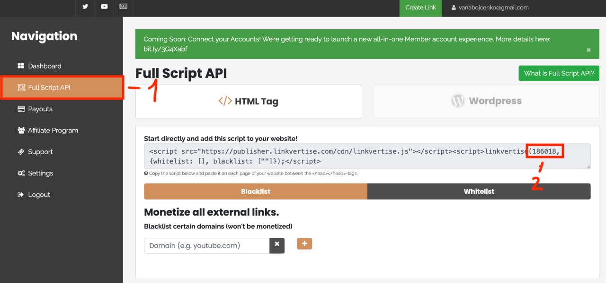

# Linkvertise

1. [Create a Linkvertise account](https://linkvertise.net/)
2. Navigate to the **Full Script API** page.
3. Enable the **Full Script API**.
4. Find your **Linkvertise ID** in the **Full Script API**.

<figure><figcaption></figcaption></figure>

5. Copy the **Anti Bypassing Token** from your account settings.

<figure><figcaption></figcaption></figure>

6. Enter your **Linkvertise ID** and **Anti-Bypassing Token** in the designated field.

<figure><figcaption></figcaption></figure>
